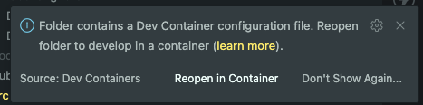
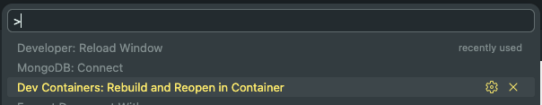

# IDE Setup (DevContainers)

We use DevContainers to ensure a consistent environment.

### VS Code

1. Install the [Dev Containers](https://marketplace.visualstudio.com/items?itemName=ms-vscode-remote.remote-containers) extension.
2. Ensure that docker is running.
   - Open the Docker Desktop app
   - Or if you only installed the docker CLI, run `sudo systemctl start docker`
3. Open the project folder.
4. When prompted "Folder contains a Dev Container configuration file", click **Reopen in Container**. Or alternatively, press `Command/Ctrl + Shift + P` and search for `Dev Containers: Rebuild and Reopen in Container`
   
   

5. This should show a toast that the Dev Container is currently building.

### Neovim / Other IDEs

If you are not using VS Code, you can use the [Devcontainer CLI](https://code.visualstudio.com/docs/remote/devcontainer-cli) or build and run the `docker-compose.yml` manually, then attach your IDE to the running container.
