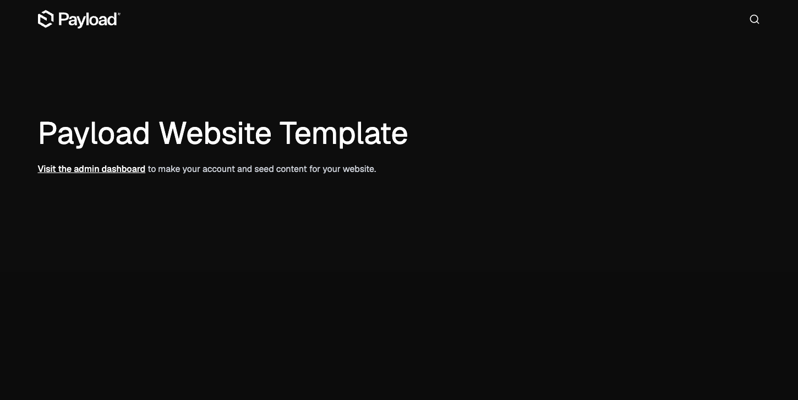
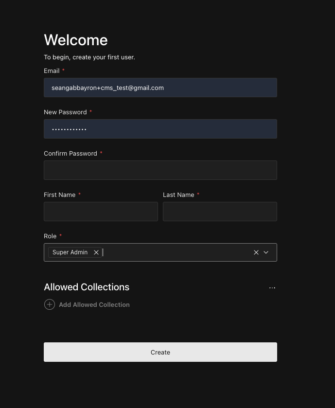
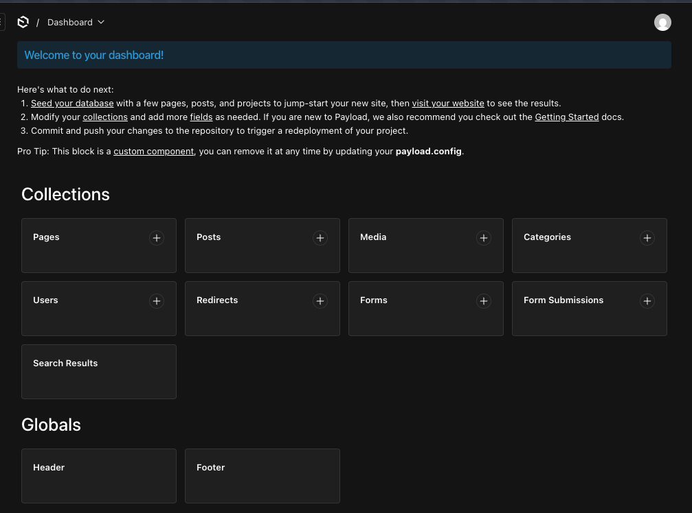

# Running the Project

Once your IDE is connected to the DevContainer, open an integrated terminal.

### 1. Prepare Development Environment

Run the following command to install dependencies and initialize all required Git hooks (Prettier, ESLint, Commitizen, etc.) in one step:

```bash
npm i && npx prek install --hook-type pre-commit --hook-type commit-msg --prepare-hooks
```

### 2. Start the Development Server

```bash
npm run dev
```

The CMS will be available at `http://localhost:3000`.

### 3. Setting up the CMS locally

1. Ensure that server is running
2. Go to `localhost:3000`
   
   <br>
3. Click on `Visit the admin dashboard` or go to `/admin`
   <br>
4. Create your local user. Ensure that `Super Admin` is selected for easy access. Leave the allowed collections blank.
   
   <br>
5. Click on `seed database` to populate your local database with mock data.
   

### Common Commands

- `npm run build`: Builds the project for production.
- `npm run lint`: Runs code linting.
- `npm run test`: Executes the test suite.
