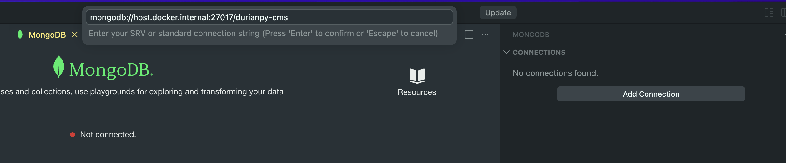
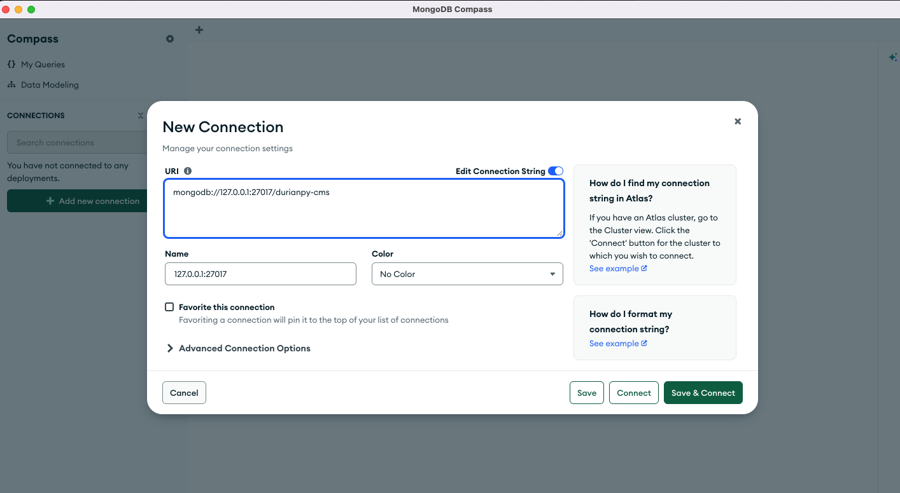

# Connecting to MongoDB

The local database runs inside a Docker container alongside the app.

### Prerequisites

Ensure your DevContainer is active and the `mongodb` container is running.

### Connection Details

Use the following URI to connect via MongoDB Compass or your preferred GUI:

- If using VSCode extension in devcontainer: `mongodb://host.docker.internal:27017/durianpy-cms`
  
   
- If using VSCode extension (not in devcontainer) or MongoDB Compass: `mongodb://127.0.0.1:27017/durianpy-cms`
  
